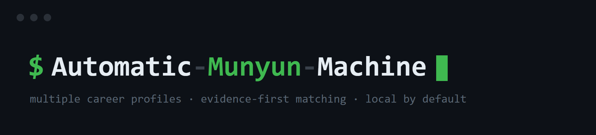

> Your resume in. Your best job matches out.

**AMM** is a local-first desktop app that finds jobs, checks their requirements against your resume, and gives you up to **200 strong matches**. Review everything from one dashboard, apply through direct links, and optionally send the batch to Telegram or email.

**Free · Private · Windows, macOS, and Linux · Built for any profession**

[Install](#install) · [How it works](#how-it-works) · [Features](#features) · [Privacy](#privacy) · [Troubleshooting](#troubleshooting)

---

## What AMM does

1. **Reads your resume** and identifies relevant titles, skills, certifications, and experience.
2. **Finds jobs** on hiring.cafe and optional Greenhouse, Lever, and Ashby company boards.
3. **Filters the noise** using your location, workplace preference, experience limit, blocked companies, recency, and other settings.
4. **Ranks each job** against your resume using the listing and full job description.
5. **Delivers a daily shortlist** in the desktop dashboard, with optional Telegram and email handoff.

AMM supports technical and non-technical careers, including healthcare, sales, finance, marketing, education, HR, administration, skilled trades, and more.

## Why use it?

- **Stop repeating the same searches.** AMM runs them on your schedule.
- **See the strongest matches first.** Every job includes a match score and explanation.
- **Apply faster.** AMM resolves direct employer application links.
- **Keep control.** Choose a 50, 100, 150, or 200 strong-match target and tune every search or filter.
- **Keep your data local.** Your resume, history, settings, and browser session stay on your computer.

## Features

### One dashboard for the whole search

- Native Windows app window with AMM's own taskbar icon and pinning identity
- Ranked jobs with search, sorting, match filters, salary, and source details
- **Apply**, **Open All**, **Save**, **Applied**, and **Why this matched** actions
- Resume rescan and automatic search-term suggestions
- Remote, hybrid, and on-site searches with optional location
- Blocked companies, job age, experience, salary, clearance, and application-form controls
- Multiple profiles, each with its own resume, searches, settings, and history
- Trends and a search-term leaderboard to show which searches produce the best matches
- Previous scrapes: every scrape is saved for 30 days — view or download any older batch (txt/csv/xlsx) from the Jobs page, so re-scraping never loses jobs
- Dice.com built in alongside hiring.cafe: every scrape can run both, hiring.cafe only, or Dice only — with per-term routing (send "iam engineer" everywhere, keep a niche term on one source). Dice jobs carry structured salary ranges, posted dates, and workplace type, merged into the same ranking pipeline with a source badge on every ranked job. Sign in to Dice from the System page (same flow as hiring.cafe) so apply links open logged in
- Light and dark themes, desktop notifications, exports, and one-click manual scrapes

### More than one job source

AMM searches hiring.cafe and can also read public job-board feeds directly from companies using:

- Greenhouse
- Lever
- Ashby

Company-board sources are optional and disabled until you add them.

### Optional delivery

The desktop dashboard is the primary app. Extra delivery channels are optional:

- **Telegram:** receive batches and run commands from your phone
- **Email:** send the apply-link list to yourself or a helper through Gmail as `.txt`, `.csv`, or `.xlsx`
- **Export:** download `.txt`, `.csv`, or `.xlsx` files with direct apply links

### Explainable matching

AMM uses the job card for a broad first pass, then loads the full description for every candidate it evaluates until it fills the requested batch or runs out of candidates. The final score measures recognized requirement coverage, target-role fit, demonstrated resume evidence, and strict experience gaps. Standard equivalents such as SSO/Single Sign-On, Entra ID/Azure AD, and OIDC/OpenID Connect count as the same skill. The same opening found on multiple sites is delivered once. Repeated buzzwords count once.

An optional bring-your-own Anthropic key adds Claude scoring inside that target-fill loop. Requests contain at most 40 jobs, but every evaluated candidate is covered across consecutive requests; 40 is not a total-job limit. It is off by default, and the key stays in the private local secret file outside config backups.

---

## Install

### Native installer — recommended

Download the correct file from the [latest GitHub release](https://github.com/7ustoo/automatic-munyun-machine/releases/latest):

| Platform | Download |
|---|---|
| Windows | `amm-setup-vX.Y.Z.exe` |
| macOS | `amm-vX.Y.Z.dmg` |
| Debian / Ubuntu | `amm_X.Y.Z_all.deb` |
| Other Linux | `amm-vX.Y.Z-x86_64.AppImage` |

Open the installer and follow the in-app setup.

**macOS:** open the `.dmg` and drag **AMM** into **Applications**, then launch it
from Launchpad or Applications. Everything AMM needs ships inside the app —
you do not need Node.js, npm, or the Terminal. A green `$` appears in your menu
bar and the setup panel opens automatically.

> The first launch shows *"AMM can't be opened because Apple cannot check it."*
> That's macOS Gatekeeper on an app without a paid Apple Developer signature.
> **Right-click the app → Open → Open** once, and macOS remembers it from then
> on. (Or: System Settings → Privacy & Security → "Open Anyway".)

On Windows, AMM uses Microsoft's WebView2 runtime for its native dashboard
window. Windows 10/11 commonly already includes it; the installer detects and
provisions the free Evergreen runtime when needed.

> Release artifacts may be unsigned when platform signing credentials are unavailable. Verify that the download came from this repository's Releases page.

### One-line install

Windows PowerShell:

```powershell
iwr -useb https://raw.githubusercontent.com/7ustoo/automatic-munyun-machine/main/install.ps1 | iex
```

macOS or Linux:

```bash
curl -fsSL https://raw.githubusercontent.com/7ustoo/automatic-munyun-machine/main/install.sh | bash
```

### Manual install

Requires Node.js 18+ and Git:

```bash
git clone https://github.com/7ustoo/automatic-munyun-machine.git
cd automatic-munyun-machine
npm install
npm run setup
```

AMM uses an installed Chrome or Edge browser for job collection when available. It downloads Playwright Chromium only when neither is present. On Windows, that collection browser is separate from AMM's native WebView2 dashboard window.

---

## First-time setup

The dashboard walks you through:

1. Uploading your resume and confirming suggested searches
2. Setting basic experience, salary, filter, and schedule preferences
3. Preparing the hiring.cafe browser session and optionally signing in
4. Optionally connecting Telegram
5. Saving the schedule and running your first batch

Fresh installs start with no profession-specific searches or company filters. Your searches are built from your resume, so AMM does not assume your career field.

After setup, use **Settings** for workplace type, location, batch size, and advanced filters. You can independently drop management/tech-lead titles and sales titles before scoring. Gmail and company-board sources can be connected from the main dashboard.

## How it works

```text
Schedule or “Scrape now”
          │
          ▼
 hiring.cafe + optional company boards
          │
          ▼
 filter → deduplicate → score full descriptions
          │
          ▼
 local dashboard and batch history
          │
          ├── optional Telegram
          ├── optional email
          └── TXT / CSV / XLSX export
```

The native Go wrapper runs the local dashboard and supervises background work. On Windows it embeds that dashboard in an AMM-owned WebView2 window, so the taskbar and pinned shortcut belong to `AMM.exe` instead of Chrome. Node.js and Playwright handle job collection, resume parsing, scoring, and delivery. The dashboard binds to `127.0.0.1`, not your local network or the public internet.

When signed into hiring.cafe, AMM asks the account to hide saved and applied jobs—but not merely viewed jobs. Delivered-job history stays local and profile-scoped, so a description inspected during ranking is not lost when the job was never shown.

---

## Useful commands

Most users can do everything from the dashboard.

### Development and manual runs

```bash
npm run setup          # CLI setup fallback
npm run daily          # run a batch now
npm run login          # refresh hiring.cafe sign-in
npm run parse-resume -- "/path/to/resume.pdf"
npm test               # Node and Go regression suites
npm run check          # fast syntax checks
```

### Telegram essentials

| Command | Action |
|---|---|
| `/scrape` | Run a fresh batch |
| `/save N` | Save job number N |
| `/applied N` | Mark job number N as applied |
| `/why N` | Explain its match score |
| `/export` | Export direct apply links |
| `/settings` | Show current settings |
| `/jobs` | List or manage search terms |
| `/resume` | Upload a new resume |
| `/status` | Check app health |
| `/help` | Show all available commands |

---

## Privacy

AMM has **no telemetry** and does not run a hosted backend.

Stored locally:

- Resume and parsed keywords
- Settings and profiles
- Browser session
- Job batches, seen-job history, and application history
- Telegram, Gmail, or optional AI credentials

Network access happens only when needed for enabled features:

- hiring.cafe and configured company job boards
- open-meteo for optional weather
- Telegram or Gmail when connected
- GitHub for update checks
- Anthropic only when optional AI reranking is enabled

Sensitive and generated files are excluded from Git through `.gitignore`, including `.env`, `config.json`, and `data/`.

## Cost

Core AMM usage is free. hiring.cafe, public company-board feeds, Telegram, open-meteo, and local scoring do not require a paid AMM service.

Optional Claude reranking uses your own Anthropic API key and may incur Anthropic charges.

## Requirements

- Windows 10/11, macOS 14+, or a modern Linux distribution
- Node.js 18+ for script/manual installs; native packages can bundle the runtime
- Chrome, Edge, or space for Playwright Chromium for job collection
- Microsoft WebView2 Runtime for the native Windows dashboard (normally present; the Windows installer provisions it when missing)
- An internet connection while collecting jobs
- A machine that is awake at the scheduled time

Telegram, Gmail, and a hiring.cafe account are optional. Signing into hiring.cafe is recommended for better deduplication.

---

## Troubleshooting

### No jobs appear

Make sure you added search terms or company-board sources. Fresh v5 installs intentionally begin without someone else's searches. Then check the latest `data/daily-batch-*.log`.

### hiring.cafe is signed out or blocked

Open **System → hiring.cafe → Sign in**, or run:

```bash
npm run login
```

### Telegram does not respond

Confirm Telegram is enabled in **System**, validate the bot token and chat, then restart AMM from the tray menu.

### The resume picker does not open

Enter the file path manually or use the dashboard upload. Headless sessions may not support a native file picker.

### A PowerShell or command window flashes on Windows

Update AMM to the latest release. Background jobs run through the native
`AMM.exe` launcher, so the scheduled batch, five-minute watchdog, missed-batch
check, notifications, and browser sign-in helpers do not create terminal
windows. The Windows installer automatically replaces older scheduled-task
definitions during an upgrade.

### Update now closes and reopens the old version

Versions before 9.0.2 could leave the scheduled watchdog running during a
silent Windows upgrade. That process kept the bundled Node runtime locked, so
the installer exited without replacing AMM. Install 9.0.2 or newer once from
the GitHub Releases page; subsequent **Update now** upgrades handle these
background processes automatically. Installer diagnostics are saved locally
under `data/update/installer.log`.

### Need more help?

Check the [open issues](https://github.com/7ustoo/automatic-munyun-machine/issues) or create one with your OS, AMM version, and the relevant log excerpt. Remove personal details and tokens before posting logs.

---

## Contributing

Contributions are welcome. Useful areas include:

- Job-source adapters under `scripts/sources/`
- Resume vocabulary in `scripts/cv-keywords.json`
- Cross-platform installer and scheduler testing
- hiring.cafe selector updates

Before opening a pull request:

```bash
npm run check
npm test
npm run test:ui
```

See [CHANGELOG.md](CHANGELOG.md) for release history and [CONTEXT.md](CONTEXT.md) for the current architecture.

## License

[MIT](LICENSE)
